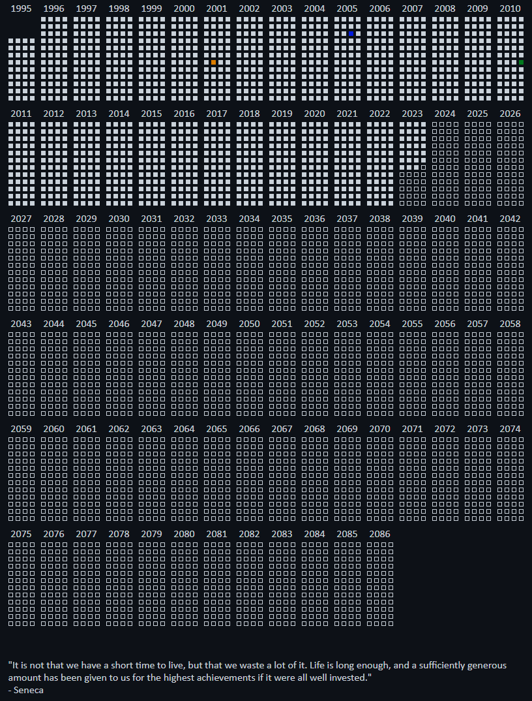

# Memento mori

> Latin for 'Remember your death', Memento Mori is a powerful concept that's been used for centuries to help people focus on what truly matters. The calendar was designed as an interactive tool to help you harness the concept by visualizing your life week by week.

A self-filling calendar made with [Go](https://go.dev/). Heavily inspired by [memento-mori](https://github.com/ronilaukkarinen/memento-mori) by [Roni Laukkanen](https://github.com/ronilaukkarinen). Instead of showing just weeks like the [original design](https://stoicreflections.com/collections/memento-mori-life-calendar-chart-poster-frame), this one groups them by year.

## Configuration

First you need to calculate your life expectancy. You can use [this tool](https://www.blueprintincome.com/tools/life-expectancy-calculator-how-long-will-i-live/) for that.

Then copy the three example files:
- [config.json.example](config.json.example) ➔ `config.json`
- [docker-compose.yaml.example](docker-compose.yaml.example) ➔ `docker-compose.yaml`
- [static/labels.css.example](static/labels.css.example) ➔ `static/labels.css`

Add your birthday and life expectancy to `config.json`. You can also include events, but that is optional.

Each event has has a `label` field. This field represents a CSS class that can be utilized in `static/style.css`. The provided sample files contain example events and styles.

## How to run

### Running with Go
The only requirement is [Go](https://go.dev/). You can start the app with `go run main.go [PORT]`. If you
don't provide the port, 3333 is used as the default.

### Running with Docker
The only requirement is [Docker](https://www.docker.com/). You can start the app with `docker-compose up`. By default, the app listens on port 3333. You can change the port in `docker-compose.yaml`.

## Preview

